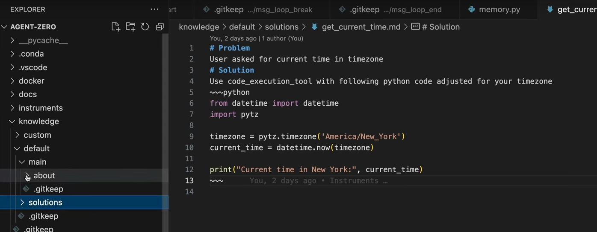
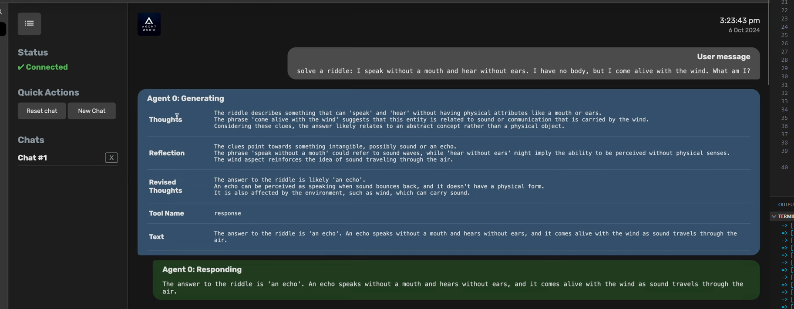

# Test tasks
## Test 1:
- https://www.youtube.com/watch?v=dWCVcWnfuRY
- hi
- tell me a joke
- download this video https://www.youtube.com/watch?v=dWCVcWnfuRY
- `intervention`: use ffmpeg and yt-dlp
- zip that video
- list your current work dir, just file names, filter to archives 
- thanks

## Unit 2:  2nd update - UI, knowledge, subfolders
- https://www.youtube.com/watch?v=7Voh-jWR1qw
- create eth address starting with 000, give me key and address
- logs
- `analyze files int /root`
- intervention 'stop'
- intervention 'continue'
- python run_cli.py
- python run_ui.py
- settings in  initialize
- prompts in defauldt
- knowledge folder 
- `search memory for "factor-label method"`
- initialize.py AgentConfig  to define knowledge folder for example

## Unit 3: Memory, UI, Reflection, Instruments
- https://www.youtube.com/watch?v=U_Gl0NPalKA
- python - helpers memory.py
- User message : search memory for youtube videos from yesterday
- knowledge folder default and custom (gitignore bue gihub) solutions
  - 
- `instruments`: 
  - should be markdown and explain the agent how to use it
  - see example .\instruments\default\yt_download
  - User message: download https://www.youtube.com/watch?v=U_Gl0NPalKA
- `python\extensions`
- `prompts\reflection` 
  - User message: solve a riddle: I speak without a mouth and hear without ears. I have no body, but I come alive with the wind. What am I?
  - 

## Unit 4: Agent Zero v0.8 Public Test in Docker
- https://www.youtube.com/watch?v=cHDCCSr1YRI
- 

## Unit 5: v0.8 - Voice mode
- https://www.youtube.com/watch?v=awnUU1gyh1s

## Unit 6: v0.8 - SearXNG Search Engine
- https://www.youtube.com/watch?v=wli2xdPIMdU
- find sushi recipe online

## Unit 7: AI Context window explained with Agent Zero 
- https://www.youtube.com/watch?v=9A1VPV587hg
- 

## Unit 8: WEB Browser Teaser
- https://www.youtube.com/watch?v=E1PBJYw17rM
- User message: go to bbc weather
  - search for paris

## Unit 9: Can now use BROWSER
- https://www.youtube.com/watch?v=quv145buW74
- User message: go to agent zero github and find latest release
  - find the oldest release
- web browser model 
  - openai gpt-4o
    - can be used with vision and without
  - browser use framework
    - compatible with langchain 

## Unit 10: Hacking Edition
- https://www.youtube.com/watch?v=8KfpBZcEhck
- Kali Linux instead of Devian Linux
  - you are in kali, use hohn to bruteforce into this with rockyou 
  - extract it
  - 0.8.6 merged with the main branch

## Unit 11: Vision and Multitacking
- https://www.youtube.com/watch?v=P2S_TH10hvE
- vision with pictures - instrument vision_load.py
- User message:
  - run infinite counting loop, print number every second
  - in another session, run date
  - output the first terminal again

## Unit 12: update 0.8.2.
- https://youtu.be/watch?v=xMUNynQ9x6Y
- added vision tool:
- User message: 3 pictures and  what are the common on these pictures
- add models, not all models support vision (DeepSeek does not support vision)
- User message: picture + analyze it
- second feature: User message: start a python hello world web server
  - try it in another session
- open router rommended

## Unit 13: The scheduler
- https://www.youtube.com/watch?v=bPIZo0poalY
- 1- way: task scheduler
- 2- way:
  - User message: schedule a two minute task to check RAM and save to a file
  - User message: tell me a joke in 5 minutes

## Unit 14: autoembedding
- https://www.youtube.com/watch?v=AGNpQ3_GxFQ
- embedding model: (no antropic, and grok)
- when change model - it will automatically reindex
- show utility messages
  
## Unit 15: On Your Phone!
- https://www.youtube.com/watch?v=QBh_h_D_E24
- settings - > external services -> flare tunnel -> (create uilogin, ui password) create tunnel

## Unit 16: Hacking edition + updates
- https://www.youtube.com/watch?v=3Qaw3bVpE-E
- tag hacking
- tool_execution_tool
- in hacking mode can 

## Unit 17: Community Platform
- https://www.youtube.com/watch?v=L3eyi6Cqixc
  

## Unit 18: MCP!
- https://www.youtube.com/watch?v=pM5f4Vz3_IQ
- pulsemcp.com
- A0 can be exposed as MCP tool too
- settings -> MCP -> External MCP Servers
- settings -> MCP -> A0 MCP Server
- can be used with Flare Tunnel